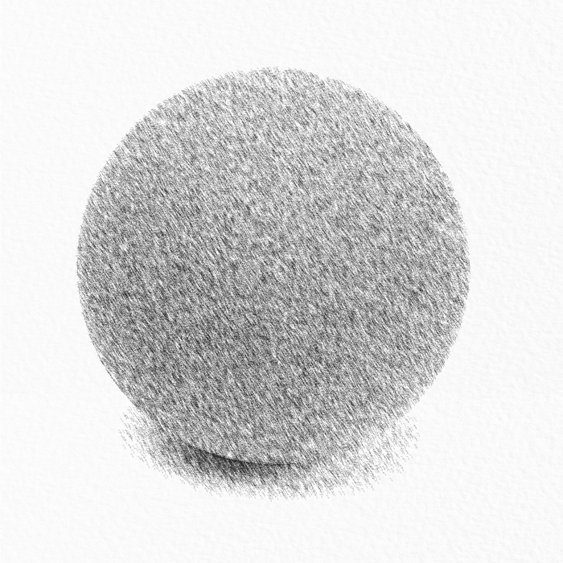
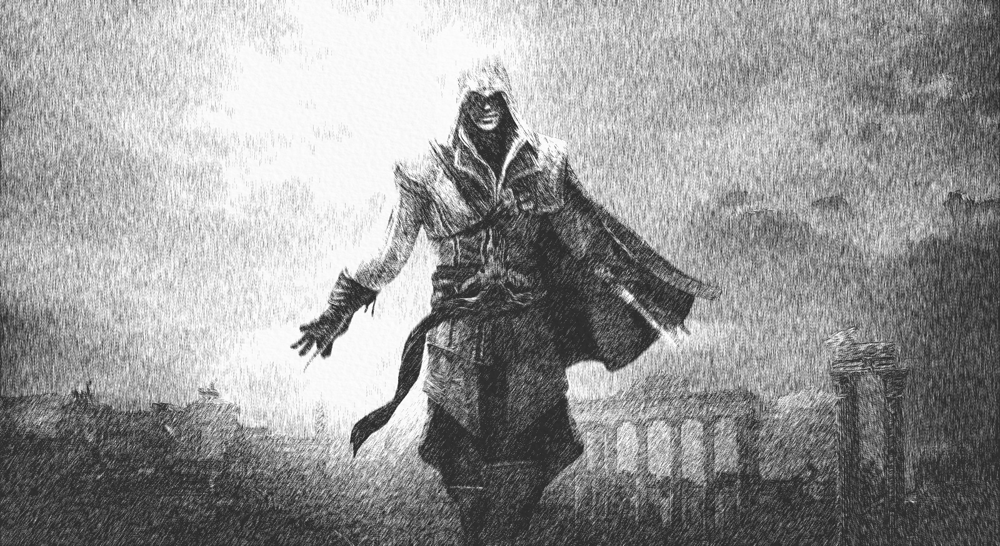
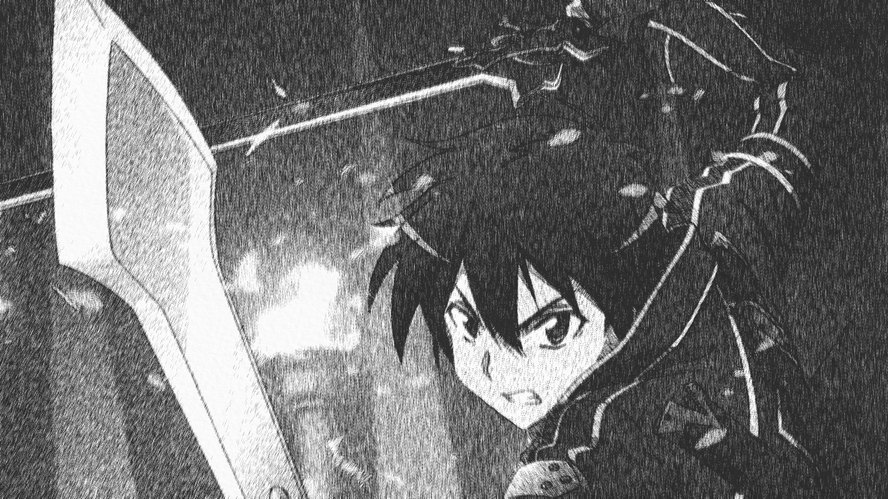

# pencil-drawing-filter

This project implements an pencil drawing filter based on some methods purposed from some papers

## Build

At first, make sure your computer has libraries listed bleow

- CMake 
- OpenCV
- OpenCV-contrib

and use CMake to build this project

```
$ git clone https://github.com/Jim00000/pencil-drawing-filter
$ cd pencil-drawing-filter
$ git submodule init
$ git submodule update
$ mkdir build
$ cd build
$ cmake ..  # or use cmake-gui ..
$ make
``` 

## Usage

In this moment, the user interface has not been done yet

## Demo








## References

- [AUTOMATIC GENERATION OF PENCIL SKETCH FOR 2D IMAGES](https://pdfs.semanticscholar.org/6317/a749fe29467cdb36b0b3cef492940ee6beb9.pdf)
- [Enanced pencil filter](http://ieeexplore.ieee.org/document/1323994/)
- [Imaging Vector Fields Using Line Integral Convolution](https://dl.acm.org/citation.cfm?id=166151)
- [Texture Synthesis with Line Integral Convolution](http://www.dcs.ed.ac.uk/teaching/cs4/www/visualisation/SIGGRAPH/lic.pdf)
- [sketch filter](https://github.com/Jim00000/sketch-filter)

## License

GNU GENERAL PUBLIC LICENSE Version 3